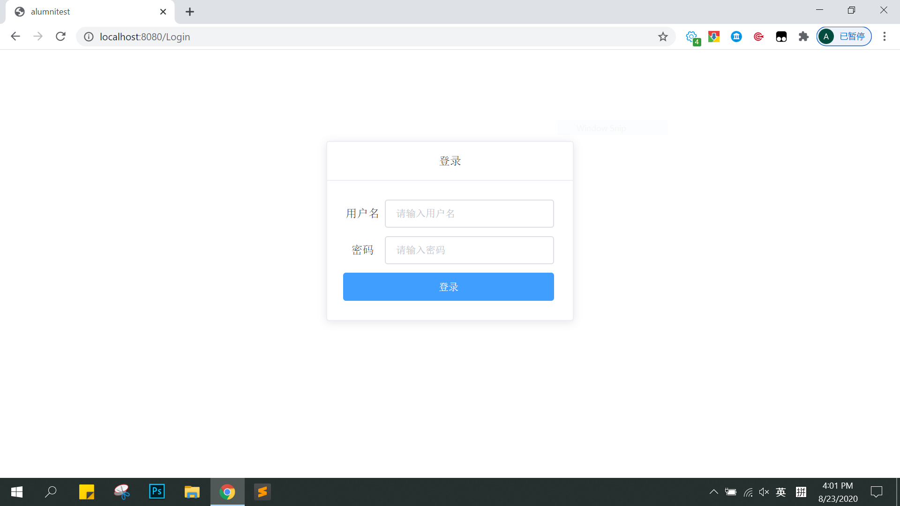
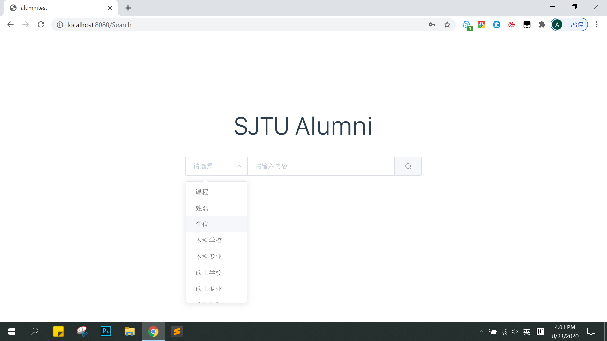
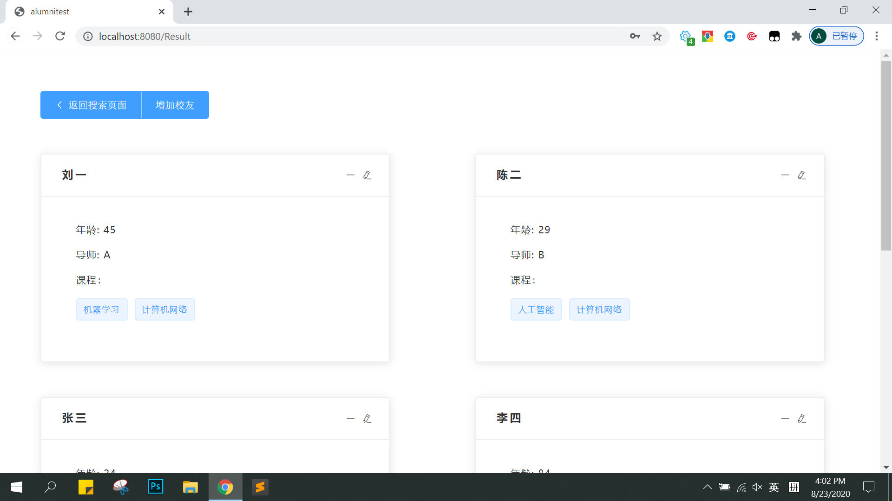
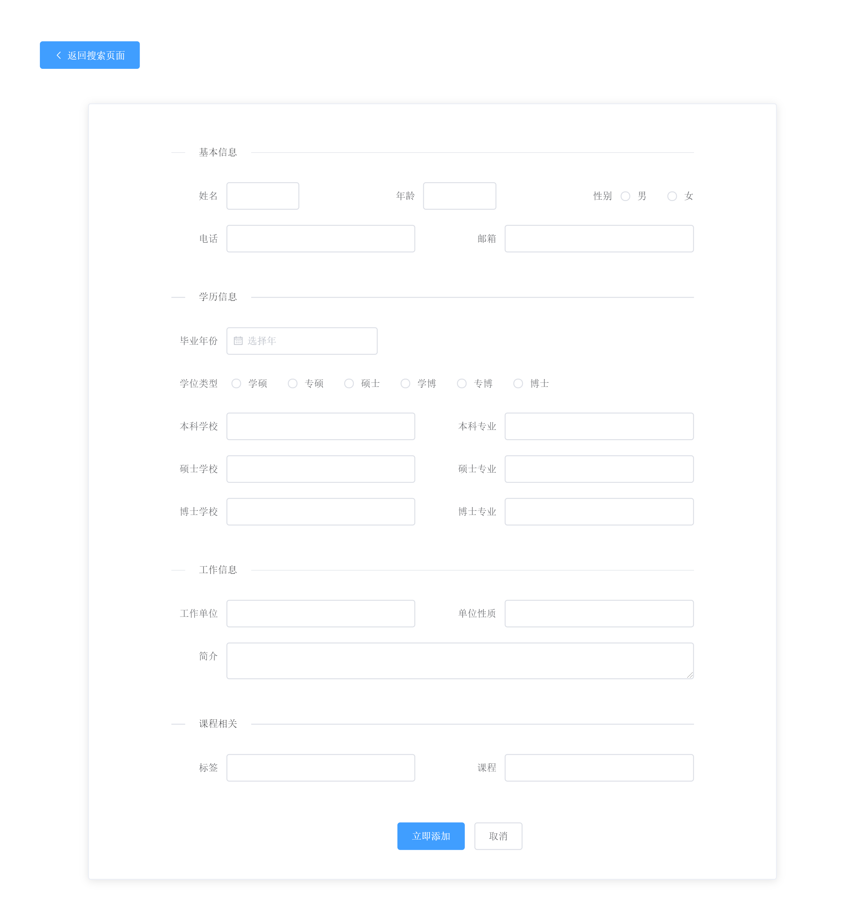

# alumnitest

一个基于Vue.js的校友信息查询系统（仅包含UI，不包括后端）

## 安装配置

#### 安装并运行Vue.js

``` bash
# install dependencies
npm install

# serve with hot reload at localhost:8080
npm run dev

# build for production with minification
npm run build

# build for production and view the bundle analyzer report
npm run build --report
```

#### 安装element-ui

``` bash
# install dependencies
npm i element-ui -S
```

## 效果展示

#### 登录页面

实现简单检测：用户名和密码不能为空



#### 搜索页面



#### 结果页面

（非管理员`增加校友`按钮会被隐藏）



#### 信息修改/增加校友页面



